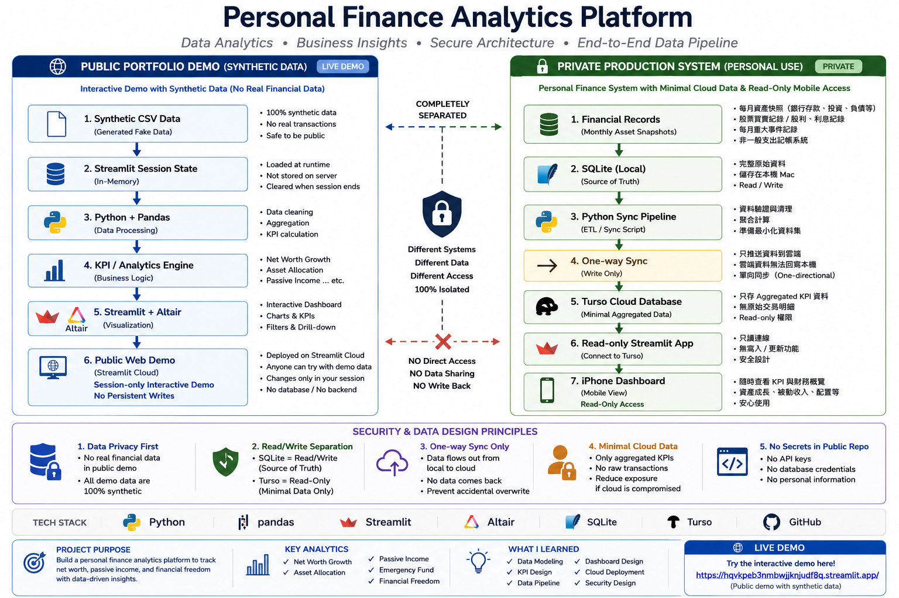

# Personal Finance Analytics Platform

> An end-to-end personal finance analytics project that transforms monthly financial records into actionable insights on net worth growth, asset allocation, passive income, emergency reserves, and financial independence.

## Live Demo

**Streamlit App:** https://hqvkpeb3nmbwjjknjudf8q.streamlit.app/

> The public portfolio demo uses synthetic data only. It does not connect to my private financial database or cloud database.

## Project Overview

Personal assets are often distributed across bank accounts, investments, foreign currency, and credit-card liabilities. Recording balances alone makes it difficult to understand long-term wealth trends or answer practical questions such as:

- Is net worth consistently growing?
- Is the current asset allocation aligned with target allocation?
- Is passive income increasing?
- Is the emergency reserve sufficient?
- How far is the portfolio from its financial-independence target?

I designed this platform around a **monthly asset snapshot** model. The application consolidates financial records into structured data, calculates key financial metrics, and presents the results through an interactive analytics dashboard.

## Key Analytics

The dashboard focuses on decision-oriented metrics rather than transaction-level budgeting:

- **Net Worth Growth** — tracks total assets, liabilities, monthly changes, and growth rates.
- **Asset Allocation** — compares bank, equity, and foreign-exchange allocation with configurable targets.
- **Income Analysis** — analyzes salary, dividends / interest, and other income.
- **Passive Income** — monitors dividend / interest trends and year-over-year performance.
- **Emergency Fund** — evaluates liquid bank assets against configurable months of living expenses.
- **Financial Independence** — estimates the target portfolio based on monthly expenses and a configurable withdrawal rate.
- **Investment Activity** — summarizes monthly buy / sell activity, net investment, income, and transaction counts.

## Demo Features

The public demo contains four interactive modules:

### Dashboard
Provides KPI cards, asset composition, annual analysis, monthly asset trends, emergency-fund status, and financial-independence progress.

### Monthly Financial Records
Allows users to add synthetic monthly asset, liability, and income records. Dashboard metrics recalculate immediately from the updated session data.

### Investment Records
Supports simulated Buy, Sell, and Dividend / Interest transactions with monthly summaries and historical analysis.

### Financial Settings
Allows users to adjust monthly living expenses, withdrawal rate, target asset allocation, and emergency-fund assumptions to observe how the analytical results change.

## Tech Stack

| Area | Technology |
|---|---|
| Programming | Python |
| Data Processing | Pandas |
| Dashboard / UI | Streamlit |
| Visualization | Altair |
| Private Local Storage | SQLite |
| Private Cloud Data Layer | Turso |
| Version Control | Git / GitHub |
| Deployment | Streamlit Community Cloud |

## Architecture



This project has two deliberately separated implementations.

### 1. Public Portfolio Demo

```text
Synthetic CSV Baseline
        ↓
Streamlit Session State
        ↓
Pandas Data Processing
        ↓
Financial KPI Calculation
        ↓
Streamlit + Altair Dashboard
```

The public application is designed for portfolio demonstration. CSV files provide synthetic baseline data, while user changes exist only within the active Streamlit session. The demo does **not** write changes back to the shared CSV files and does not connect to the private SQLite or Turso databases.

### 2. Private Production Version

```text
Local Financial Records
        ↓
SQLite — Source of Truth
        ↓
Python One-way Sync Pipeline
        ↓
Aggregated / Minimal Dashboard Data
        ↓
Turso Cloud Database
        ↓
Read-only Streamlit Mobile Dashboard
```

The original private system uses SQLite as the primary source of truth. A Python synchronization process sends only the aggregated data required by the mobile dashboard to the cloud.

The architecture separates **write credentials used by the local synchronization process** from **read-only credentials used by the mobile viewer**, reducing unnecessary exposure of both source data and write permissions.

## Data & Security Design

Privacy was treated as an architectural requirement rather than an afterthought.

**Public portfolio version**
- Uses synthetic financial data only.
- Contains no personal financial records.
- Contains no database credentials or tokens.
- Session changes do not modify the shared baseline dataset.

**Private production version**
- Keeps the complete financial dataset locally in SQLite.
- Uses one-way synchronization from local storage to the cloud.
- Synchronizes only the data required for dashboard analytics.
- Separates read and write credentials.
- Provides read-only access to the mobile dashboard.
- Keeps secrets outside source control.

## Demo Data Story

The synthetic dataset was designed to represent a realistic wealth-management scenario rather than random numbers.

It demonstrates a period of steady asset accumulation, an equity-market drawdown, subsequent portfolio recovery, increased income and investment contributions, and higher passive income. This allows the dashboard to demonstrate how the analytical metrics react to meaningful changes over time.

## Analytical Workflow

```text
Input
  ↓
Structured Financial Data
  ↓
Data Processing
  ↓
KPI Calculation
  ↓
Trend & Allocation Analysis
  ↓
Interactive Visualization
  ↓
Financial Insights
```

This project demonstrates the full path from data collection to business-oriented analytical output rather than visualization alone.

## What I Learned

Through this project, I practiced and integrated:

- Translating real-world questions into measurable KPIs.
- Designing a structured monthly financial data model.
- Building reusable data-processing logic with Python and Pandas.
- Developing interactive analytical dashboards.
- Handling partial-year / YTD comparisons correctly.
- Designing an end-to-end local-to-cloud data flow.
- Separating source-of-truth data from presentation-layer data.
- Applying least-privilege and one-way synchronization concepts to personal-data architecture.
- Deploying and maintaining a public Streamlit application with Git and GitHub.

## Repository Scope

This repository contains the **public portfolio demo only**.

The private production database, synchronization credentials, personal financial records, and private application source are intentionally excluded.

---

### Try the Demo

**Live Application:** https://hqvkpeb3nmbwjjknjudf8q.streamlit.app/

Built with **Python · Pandas · Streamlit · Altair**
